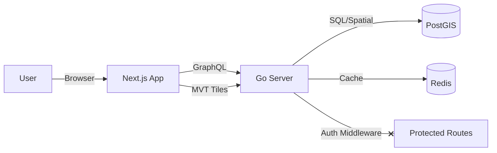

# Forest BD Viewer — Île-de-France

A full-stack geospatial application for visualizing French forest data (BD Forêt® V2) and land parcels (Cadastre). Built with Go, Next.js, and PostGIS, designed to run entirely in Docker.


## 🌲 Overview

This project allows authenticated users to:

1. **Visualize** forest data for Île-de-France departments (77, 78, 91, 95).
2. **Interact** with a hierarchical map (Region → Department → Commune).
3. **Inspect** forest species and cover types.
4. **Analyze** custom areas using a polygon drawing tool.
5. **Overlay** official Cadastre parcel data.

## 🏗 Architecture

### Tech Stack

| Component | Technology | Reasoning |
|-----------|------------|-----------|

| **Frontend** | Next.js 14, TypeScript, Redux Toolkit | Server-side rendering, robust state management |
| **Map Engine** | Mapbox GL JS | High-performance vector tile rendering |
| **Backend** | Go (1.22+), Echo, gqlgen | High-concurrency spatial API, type-safe GraphQL |
| **Database** | PostgreSQL 16 + PostGIS 3.4 | Industry-standard spatial database |
| **Cache** | Redis 7 | Caching vector tiles and user sessions |
| **Auth** | JWT (httpOnly cookie) | Secure, stateless authentication |
| **Infrastructure** | Docker Compose | One-command deployment |

### Data Flow



## 📂 Project Structure

```
forest_bd_viewer/
├── backend/                # Go Backend
│   ├── cmd/server/         # Entry point
│   ├── internal/
│   │   ├── auth/           # JWT & Middleware
│   │   ├── cache/          # Redis client
│   │   ├── config/         # Viper config
│   │   ├── database/       # Pgxpool & Migrations
│   │   ├── geo/            # Spatial queries
│   │   ├── graph/          # GraphQL resolvers (gqlgen)
│   │   └── tiles/          # MVT Tile generation
│   ├── migrations/         # SQL migration files
│   ├── Dockerfile
│   └── go.mod
├── frontend/               # Next.js Frontend
│   ├── src/
│   │   ├── app/            # App Router pages
│   │   ├── components/     # React components (Map, Sidebar)
│   │   ├── lib/            # Utilities (GraphQL client)
│   │   └── store/          # Redux slices
│   ├── Dockerfile
│   └── next.config.ts
├── scripts/                # Data processing
│   ├── download-data.sh    # Fetch BD Forêt from IGN
│   └── import-data.sh      # Import SHP to PostGIS
├── docker-compose.yml      # Full stack orchestration
└── README.md
```

## 🚀 Getting Started

### Prerequisites

- Docker & Docker Compose
- Mapbox Access Token (free tier)

### Setup

1. **Clone & Config**

    ```bash
    git clone <repo>
    cd forest_bd_viewer
    cp .env.example .env
    # Edit .env and set NEXT_PUBLIC_MAPBOX_TOKEN
    ```

2. **Run with Docker**

    ```bash
    docker-compose up --build
    ```

    - Frontend: `http://localhost:3000`
    - Backend Health: `http://localhost:8080/health`

3. **Data Import (One-time)**
    *Note: The app starts with an empty database. You need to run the import scripts to populate forest data.*

    ```bash
    ./scripts/download-data.sh
    ./scripts/import-data.sh  # Requires ogr2ogr or run inside docker
    ```

## 🗺 Features & Roadmap

- [x] **Infrastructure**: Docker Compose, PostGIS, Redis, Go+Next.js skeletons
- [ ] **Authentication**: Register/Login with JWT cookies
- [ ] **Data**: Import BD Forêt V2 (Dept 77, 78, 91, 95)
- [ ] **Visualization**: Vector tiles with species color-coding
- [ ] **Drill-down**: Region → Commune interaction
- [ ] **Cadastre**: Overlay parcels at high zoom
- [ ] **Analysis**: Polygon tool for area & species stats

## 🔧 Development

- **Backend**: Changes in `backend/` trigger a recompile (if using air) or require restart.
- **Frontend**: Next.js hot-reloads on file changes.
- **Database**: Data persists in `pgdata` volume.

## 📄 License

MIT
