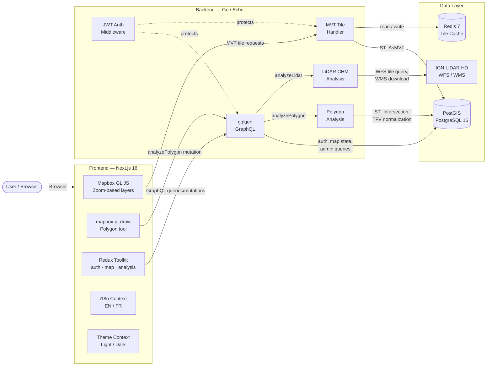

# Forest BD Viewer — Ile-de-France

A full-stack geospatial application for visualizing French forest data (BD Foret V2) and land parcels (Cadastre) across Ile-de-France departments (77, 78, 91, 95). Built with Go, Next.js, and PostGIS, designed to run entirely in Docker.


---

## Overview

Authenticated users can:

- **Visualize** forest cover with species-level color coding on an interactive map
- **Drill down** through administrative layers: Region > Department > Commune
- **Inspect** BD Foret V2 vegetation types and Cadastre parcels at high zoom levels
- **Analyze** custom areas by drawing polygons — get forest cover stats, TFV breakdown, and species composition
- **LiDAR CHM analysis** — compute Canopy Height Model from IGN LIDAR HD data with map overlay (where coverage exists)
- **Switch language** between English (default) and French
- **Toggle dark mode** with a forest-at-dusk color palette, persisted in localStorage

---

## Architecture

### Tech Stack

| Component | Technology |
|-----------|-----------|
| Frontend | Next.js 16, React 19, TypeScript, Redux Toolkit |
| Map Engine | Mapbox GL JS 3.x + mapbox-gl-draw |
| Backend | Go 1.24, Echo v4, gqlgen (GraphQL) |
| Database | PostgreSQL 16 + PostGIS 3.4 |
| Cache | Redis 7 (MVT tile cache, 24h/7d TTL) |
| Auth | JWT (HS256) via httpOnly cookie |
| i18n | Context-based EN/FR dictionary |
| Theming | CSS custom properties, light/dark mode with localStorage persistence |
| Infrastructure | Docker Compose (4 services) |

### Data Flow



### Services

| Service | Image | Port | Role |
|---------|-------|------|------|
| `postgres` | `postgis/postgis:16-3.4-alpine` | 5432 | Spatial database |
| `redis` | `redis:7-alpine` | 6379 | Tile cache |
| `backend` | Custom (Go) | 8080 | API, GraphQL, tile server |
| `frontend` | Custom (Node) | 3000 | Next.js app |

---

## Getting Started

### Prerequisites

- **Docker** and **Docker Compose** (v2)
- **Mapbox access token** — free at [mapbox.com](https://account.mapbox.com/access-tokens/)
- ~2 GB disk space for geospatial data

### 1. Clone and Configure

```bash
git clone <repo-url>
cd forest_bd_viewer
cp .env.example .env
```

Edit `.env` and set your Mapbox token:

```
NEXT_PUBLIC_MAPBOX_TOKEN=pk.eyJ1Ijoi...your_token_here
```

All other defaults work out of the box for local development. See [Environment Variables](#environment-variables) for the full list.

### 2. Start Services

```bash
docker-compose up --build
```

Wait for all health checks to pass (postgres, redis, backend, frontend). First build takes a few minutes.

- **Frontend**: http://localhost:3000
- **Backend health**: http://localhost:8080/health
- **GraphQL playground**: POST to http://localhost:8080/graphql

The database is empty at this point — the map renders but has no forest data. Proceed to step 3.

### 3. Create an Account

Open http://localhost:3000/register and create a user. Authentication is required for map tiles, polygon analysis, and cadastre data.

### 4. Download Source Data

```bash
./scripts/download-data.sh
```

This downloads:
- **Admin boundaries** (regions, departments, communes) from france-geojson and geo.api.gouv.fr
- **Cadastre parcels** per commune from cadastre.data.gouv.fr

**BD Foret V2 must be downloaded manually** (IGN requires authentication):

1. Go to https://geoservices.ign.fr/bdforet
2. Create a free IGN account
3. Download the SHP files for departments **77, 78, 91, 95**
4. Extract and place them at:

```
data/raw/bdforet/77/FORMATION_VEGETALE.shp  (+ .dbf, .shx, .prj)
data/raw/bdforet/78/FORMATION_VEGETALE.shp
data/raw/bdforet/91/FORMATION_VEGETALE.shp
data/raw/bdforet/95/FORMATION_VEGETALE.shp
```

### 5. Import Data into PostGIS

```bash
docker exec -it forest_backend python3 /app/scripts/import_data.py
```

This imports all downloaded data into PostGIS tables (regions, departements, communes, cadastre_parcelles, forest_parcels) with spatial indexes. Depending on hardware and data volume, this takes 5-15 minutes.

### 6. Verify

Reload the frontend. At zoom 14+, you should see color-coded forest polygons. Use the polygon tool to analyze an area.

---

## Features

### Map Layers (zoom-dependent)

| Zoom Level | Layer | Interaction |
|-----------|-------|-------------|
| 5-7 | Regions | Click to zoom in |
| 8-10 | Departments | Click to zoom in |
| 11-13 | Communes | Click to zoom in |
| 14+ | BD Foret V2 (forest types) | Click for species popup |
| 15+ | Cadastre parcels (overlay) | Click for parcel info |

### Polygon Analysis

Click **"Analyse area"**, then click on the map to place vertices. Press **"Finish"** (or double-click) to complete the polygon. Results include:

- Total area (hectares)
- Forest cover (hectares and percentage)
- Number of forest parcels
- **TFV breakdown**: Forest structure categories (closed broadleaf, closed conifer, open, moorland, etc.) with color-coded bars
- **Species breakdown**: Top 8 dominant tree species by area

The polygon is immovable after creation — close the panel or draw a new polygon to clear it.

### LiDAR CHM Analysis (Bonus B)

When a polygon is drawn, the backend also queries IGN's LIDAR HD tile index for MNS (Digital Surface Model) and MNT (Digital Terrain Model) data. If coverage exists:

- Computes **CHM = MNS - MNT** (Canopy Height Model) per pixel
- Returns **min/max/mean/median canopy height** statistics in the analysis panel
- Overlays a **color-coded CHM heatmap** (green -> yellow -> red) on the map

**Note**: LIDAR HD coverage is progressive across France. Ile-de-France currently has no coverage, so the panel shows "No LiDAR HD coverage" for this area. The feature works for polygons in covered regions (see [LIDAR HD coverage](https://diffusion-lidarhd.ign.fr/)).

### Internationalization

The UI defaults to English. Click the language toggle (top of sidebar) to switch to French. All UI labels, legend items, popups, and analysis results are translated.

### TFV Code Normalization

BD Foret V2 uses hierarchical vegetation codes (e.g., `FF1-09-09`, `FF1G01-01`). Legacy departments (78, 91) use TFIFN codes (`AFJ`, `CPV`, `30`). The backend normalizes all codes to 9 top-level categories for consistent display:

| Code | English | French |
|------|---------|--------|
| FF1 | Closed broadleaf forest | Foret fermee feuillus |
| FF2 | Closed conifer forest | Foret fermee coniferes |
| FF3 | Closed mixed forest | Foret fermee mixte |
| FF4 | Closed forest (other) | Foret fermee autre |
| FO1 | Open broadleaf forest | Foret ouverte feuillus |
| FO2 | Open conifer forest | Foret ouverte coniferes |
| FO3 | Open mixed forest | Foret ouverte mixte |
| LA | Moorland | Lande |
| FP | Poplar plantation | Peupleraie |

---

## Project Structure

```
forest_bd_viewer/
├── backend/
│   ├── cmd/server/main.go          # Echo setup, DB/Redis init, routes
│   ├── internal/
│   │   ├── auth/                    # JWT generation, bcrypt, middleware
│   │   ├── cache/                   # Redis client
│   │   ├── config/                  # Viper config
│   │   ├── database/               # pgxpool init, auto-migrations
│   │   ├── geo/                    # Spatial queries
│   │   │   ├── forest.go           # MVT forest tiles
│   │   │   ├── admin.go            # MVT admin boundary tiles
│   │   │   ├── cadastre.go         # MVT cadastre tiles
│   │   │   ├── analysis.go         # Polygon analysis (TFV normalization)
│   │   │   ├── lidar.go            # LiDAR CHM: WFS query, download, computation
│   │   │   └── geotiff.go          # Pure Go float32 GeoTIFF reader
│   │   ├── graph/                  # gqlgen resolvers + schema
│   │   │   ├── schema/             # .graphql source files
│   │   │   ├── generated/          # Auto-generated (do not edit)
│   │   │   └── model/              # Auto-generated (do not edit)
│   │   └── tiles/                  # MVT HTTP handlers
│   ├── migrations/                 # SQL migrations (000001-000005)
│   └── Dockerfile
├── frontend/
│   ├── src/
│   │   ├── app/                    # Next.js App Router pages
│   │   ├── components/
│   │   │   ├── Map.tsx             # Mapbox GL map + draw tool
│   │   │   └── AnalysisPanel.tsx   # Polygon analysis results
│   │   ├── lib/
│   │   │   ├── graphql.ts          # GraphQL client (credentials: include)
│   │   │   └── i18n.tsx            # EN/FR dictionary + React context
│   │   └── store/                  # Redux slices (auth, map, analysis)
│   └── Dockerfile
├── scripts/
│   ├── download-data.sh            # Download admin, cadastre, BD Foret data
│   ├── import-data.sh              # Wrapper for import_data.py
│   └── import_data.py              # PostGIS importer (ogr2ogr + psycopg2)
├── data/raw/                       # Downloaded source data (gitignored)
├── docker-compose.yml
├── .env.example
├── agents.md                       # AI agent context document
└── tasks.md                        # Development task checklist
```

---

## Environment Variables

Copy `.env.example` to `.env`. All values are consumed by Docker Compose.

| Variable | Default | Required | Notes |
|----------|---------|----------|-------|
| `POSTGRES_USER` | `forestviewer` | Yes | Database user |
| `POSTGRES_PASSWORD` | `forestviewer_secret` | Yes | **Change in production** |
| `POSTGRES_DB` | `forest_bd` | Yes | Database name |
| `POSTGRES_HOST` | `postgres` | Yes | Docker service name |
| `POSTGRES_PORT` | `5432` | Yes | |
| `REDIS_HOST` | `redis` | Yes | Docker service name |
| `REDIS_PORT` | `6379` | Yes | |
| `BACKEND_PORT` | `8080` | Yes | |
| `JWT_SECRET` | (placeholder) | Yes | **Change in production** (min 32 chars) |
| `JWT_EXPIRY_HOURS` | `24` | No | Token lifetime |
| `NEXT_PUBLIC_MAPBOX_TOKEN` | (none) | Yes | Get from mapbox.com |
| `NEXT_PUBLIC_API_URL` | `http://localhost:8080` | Yes | Backend URL for frontend |

---

## API Reference

### REST Endpoints

| Method | Path | Auth | Description |
|--------|------|------|-------------|
| GET | `/health` | No | DB and Redis status |
| POST | `/graphql` | Mixed | GraphQL endpoint |
| GET | `/tiles/foret/{z}/{x}/{y}.mvt` | Yes | Forest MVT tiles (24h cache) |
| GET | `/tiles/admin/{layer}/{z}/{x}/{y}.mvt` | No | Admin boundary tiles (7d cache) |
| GET | `/tiles/cadastre/{z}/{x}/{y}.mvt` | Yes | Cadastre parcel tiles (24h cache) |
| GET | `/lidar/chm/{id}.png` | No | Generated CHM overlay images |

### GraphQL Schema

```graphql
type Query {
  me: User
  regions: [Region!]!
  departements(regionCode: String): [Departement!]!
  communes(departementCode: String): [Commune!]!
  myMapState: MapState
}

type Mutation {
  register(email: String!, password: String!, name: String!): AuthPayload!
  login(email: String!, password: String!): AuthPayload!
  logout: Boolean!
  saveMapState(lng: Float!, lat: Float!, zoom: Float!): Boolean!
  analyzePolygon(geojson: String!): PolygonAnalysis!
  analyzeLidar(geojson: String!): LidarAnalysis!
}

type PolygonAnalysis {
  areaHa: Float!
  forestCoverHa: Float!
  forestCoverPct: Float!
  parcelCount: Int!
  tfvBreakdown: [TfvBreakdown!]!
  speciesBreakdown: [SpeciesBreakdown!]!
}

type LidarAnalysis {
  hasCoverage: Boolean!
  message: String
  minHeight: Float
  maxHeight: Float
  meanHeight: Float
  medianHeight: Float
  chmImageUrl: String
  bounds: [Float!]
}
```

---

## Development

### Backend (Go)

```bash
cd backend
go build ./...          # Compile
go test ./...           # Run tests
go generate ./internal/graph/...  # Regenerate GraphQL after schema changes
```

Migrations in `migrations/` run automatically on startup. Current: `000001`-`000005`. Next available: `000006`.

### Frontend (Next.js)

```bash
cd frontend
npm install
npm run dev             # Dev server with hot reload at :3000
npm run build           # Production build
npx tsc --noEmit        # Type check
```

### Adding a GraphQL Field

1. Edit the relevant `.graphql` file in `backend/internal/graph/schema/`
2. Run `go generate ./internal/graph/...` to regenerate stubs
3. Implement the resolver in the corresponding `.resolvers.go` file
4. Update the frontend query/mutation and Redux slice if needed

### Adding a Migration

1. Create `backend/migrations/000006_description.up.sql` and `.down.sql`
2. Migrations run automatically on backend startup

---

## Data Sources

| Dataset | Source | License | Format |
|---------|--------|---------|--------|
| BD Foret V2 | [IGN](https://geoservices.ign.fr/bdforet) | Licence Ouverte 2.0 | SHP |
| LIDAR HD | [IGN](https://diffusion-lidarhd.ign.fr/) | Licence Ouverte 2.0 | GeoTIFF (MNS/MNT) |
| Cadastre | [Etalab](https://cadastre.data.gouv.fr) | Licence Ouverte 2.0 | GeoJSON |
| Admin Boundaries | [france-geojson](https://github.com/gregoiredavid/france-geojson) / [geo.api.gouv.fr](https://geo.api.gouv.fr) | Open Data | GeoJSON |

---

## Troubleshooting

**Map is blank / no tiles loading**
- Check that `NEXT_PUBLIC_MAPBOX_TOKEN` is set correctly in `.env`
- Verify you are logged in (forest and cadastre tiles require authentication)

**No forest data visible at zoom 14+**
- Data has not been imported. Run the download and import steps (see Getting Started steps 4-5)

**`ogr2ogr` errors during import**
- The import script copies SHP files to `/tmp` to work around Docker VirtioFS extended attribute issues. Ensure the backend container has write access to `/tmp`.

**GraphQL errors ("authentication required")**
- Forest tile and analysis endpoints require a valid JWT. Log in via the frontend or send a valid `auth_token` cookie.

**Build fails on Apple Silicon**
- The `postgres` image uses `platform: linux/amd64` for compatibility. Docker Desktop handles this via Rosetta emulation.

---

## License

MIT
